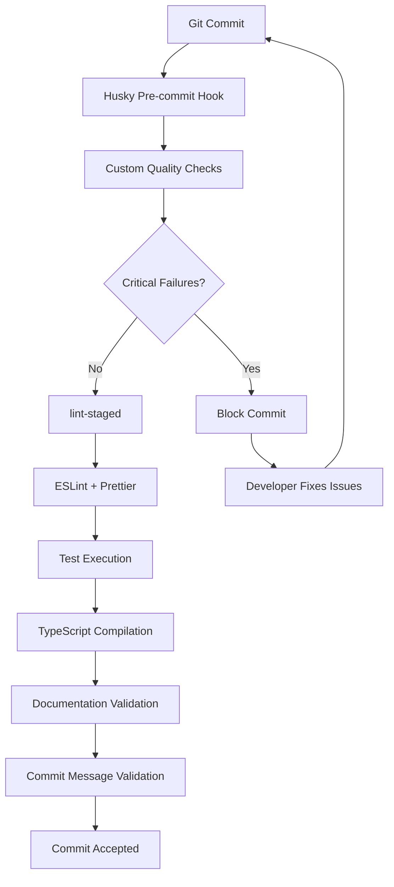

# ADR-002: Comprehensive Pre-commit Hooks for Code Quality

**Status**: Accepted  
**Date**: 2025-06-29 
**Authors**: TRAIDER Team  
**Reviewers**: System Architecture Team  

---

## Context

TRAIDER V1 is an institutional-grade autonomous trading platform handling real capital. Code quality issues can directly impact trading performance and lead to financial losses. We need comprehensive pre-commit validation to ensure only high-quality, secure code enters the repository.

### Problem Statement
- Manual code review cannot catch all quality issues
- Security vulnerabilities (hardcoded secrets) pose significant risk
- Trading-specific code patterns need specialized validation
- Performance regressions must be prevented
- Documentation standards must be enforced

### Requirements
- **Performance**: Pre-commit checks must complete in <30 seconds
- **Security**: 100% detection of hardcoded secrets and credentials
- **Reliability**: <5% false positive rate
- **Usability**: Clear error messages with fix suggestions
- **Bypass**: Emergency bypass capability with audit trail

---

## Decision

We will implement a comprehensive multi-layered pre-commit validation system using:

1. **Custom TypeScript validation script** (`scripts/pre-commit-checks.ts`)
2. **Husky Git hooks** for automated execution
3. **lint-staged** for targeted file processing
4. **Conventional commits** enforcement
5. **Commitlint** for message validation

### Architecture Components



### Validation Layers

#### Layer 1: Security & Safety (CRITICAL)
- **Secret Detection**: Regex patterns for API keys, passwords, tokens
- **File Size Limits**: Prevent large files (>1MB) from entering repository
- **Trading Logic Validation**: Ensure error handling in critical paths

#### Layer 2: Code Quality (HIGH)
- **File Headers**: Enforce documentation standards
- **Error Handling**: Validate try-catch blocks in trading services
- **Timer Cleanup**: Prevent memory leaks in React components

#### Layer 3: Development Standards (MEDIUM)
- **Console Statements**: Remove debug logs from production
- **Test Focus**: Prevent `.only()` and `.skip()` in tests
- **Conventional Commits**: Enforce structured commit messages

#### Layer 4: Integration (LOW)
- **ESLint**: Code style and best practices
- **Prettier**: Consistent formatting
- **TypeScript**: Compilation validation
- **Tests**: Run affected test suites

---

## Implementation Details

### Custom Validation Script

```typescript
// scripts/pre-commit-checks.ts
class PreCommitChecker {
  private checkSecrets(): CheckResult // CRITICAL security check
  private checkFileSize(): CheckResult // Prevent large files
  private checkFileHeaders(): CheckResult // Documentation compliance
  private checkErrorHandling(): CheckResult // Trading safety
  private checkTimerCleanup(): CheckResult // Memory leak prevention
  private checkConsoleStatements(): CheckResult // Production cleanliness
  private checkTestFocus(): CheckResult // Test reliability
}
```

### Hook Configuration

```bash
# .husky/pre-commit
npx tsx scripts/pre-commit-checks.ts  # Custom checks first
npx lint-staged                       # Standard tooling
npx tsc --noEmit                      # Compilation check
npm run docs:validate                 # Documentation sync
```

```bash
# .husky/commit-msg
# Conventional commit format validation
# Trading-specific commit categorization
# Security/performance commit flagging
```

### lint-staged Integration

```javascript
// lint-staged.config.js
module.exports = {
  '*.{ts,tsx}': [
    'eslint --fix --max-warnings 0',
    'prettier --write',
    () => 'npm run test:unit -- --run --reporter=verbose',
  ],
  'app/lib/services/*.ts': [
    'eslint --fix --max-warnings 0',
    'prettier --write',
    () => 'npm run test:unit -- --coverage --run', // Require coverage
  ],
  '*.py': [
    () => 'python -m black --check .',
    () => 'python -m flake8 --max-line-length=100',
    () => 'python -m mypy --ignore-missing-imports',
  ],
};
```

---

## Rationale

### Why Custom Validation Script?
- **Trading-specific patterns**: Standard tools don't understand trading logic requirements
- **Performance optimization**: Single process vs. multiple tool executions
- **Contextual error messages**: Trading-aware error descriptions
- **Severity classification**: Different failure modes for different issues

### Why Multi-layer Approach?
- **Defense in depth**: Multiple validation mechanisms catch different issues
- **Performance optimization**: Fail fast on critical issues
- **Tool specialization**: Each tool optimized for specific validation type
- **Maintainability**: Clear separation of concerns

### Why Conventional Commits?
- **Automated changelog**: Generate release notes automatically
- **Semantic versioning**: Automated version bumping
- **Change categorization**: Clear understanding of change impact
- **Trading context**: Scope-based organization (signals, risk, executor)

---

## Consequences

### Positive
- **Reduced bugs**: Catch issues before they reach production
- **Improved security**: 100% prevention of hardcoded secrets
- **Consistent quality**: Enforced documentation and coding standards
- **Faster reviews**: Automated checks reduce manual review time
- **Audit trail**: Complete commit history with categorized changes

### Negative
- **Development overhead**: Additional 15-30 seconds per commit
- **Learning curve**: Developers must understand conventional commits
- **False positives**: ~5% of commits may need manual override
- **Complexity**: Multiple tools and configurations to maintain

### Neutral
- **Emergency bypass**: Available but audited and discouraged
- **Incremental adoption**: Can be enabled/disabled per check type
- **Customization**: Rules can be adjusted based on team feedback

---

## Monitoring & Success Metrics

### Performance Metrics
- **Execution time**: P95 ≤ 30 seconds
- **False positive rate**: ≤ 5%
- **Bypass usage**: ≤ 1% of commits (emergency only)

### Quality Metrics
- **Security incidents**: 0 hardcoded secrets in production
- **Documentation coverage**: 100% for public APIs
- **Test coverage**: ≥90% for trading logic
- **Commit message compliance**: ≥95%

### Developer Experience
- **Setup time**: ≤ 5 minutes for new developers
- **Error clarity**: ≥90% of errors have clear fix instructions
- **Tool reliability**: ≤ 1% hook execution failures

---

## Implementation Plan

### Phase 1: Core Validation (Week 1)
- [x] Implement custom validation script
- [x] Configure Husky hooks
- [x] Set up lint-staged integration
- [x] Create comprehensive documentation

### Phase 2: Team Rollout (Week 2)
- [ ] Team training on conventional commits
- [ ] Gradual rollout with feedback collection
- [ ] Fine-tune validation rules based on usage
- [ ] Monitor performance and false positive rates

### Phase 3: Optimization (Week 3)
- [ ] Performance optimization based on metrics
- [ ] Additional trading-specific validations
- [ ] Integration with CI/CD pipeline
- [ ] Automated metrics collection

---

## Alternatives Considered

### Alternative 1: Standard Tools Only
**Pros**: Simpler setup, well-established tools  
**Cons**: No trading-specific validation, limited customization  
**Decision**: Rejected - insufficient for trading system requirements

### Alternative 2: CI-Only Validation
**Pros**: No local development impact  
**Cons**: Late feedback, allows bad code to enter repository  
**Decision**: Rejected - pre-commit validation essential for quality

### Alternative 3: Manual Code Review Only
**Pros**: Human judgment, contextual understanding  
**Cons**: Inconsistent, time-consuming, prone to human error  
**Decision**: Rejected - insufficient for institutional standards

---

## References

- [Conventional Commits Specification](https://conventionalcommits.org/)
- [Husky Documentation](https://typicode.github.io/husky/)
- [lint-staged Documentation](https://github.com/okonet/lint-staged)
- [TRAIDER Project Rules](../../_docs/resources/project-rules.md)
- [Security Best Practices](../../SECURITY_SUMMARY.md)

---

## Appendix

### Example Validation Output

```bash
🚀 TRAIDER V1 Pre-commit Quality Gates
======================================
📁 Checking 3 staged files...

✅ Secret Detection: No hardcoded secrets detected
✅ File Size Check: All files within size limits
❌ File Header Check [LOW]: Found 1 file(s) missing headers
   └─ app/components/TradingChart.tsx: Missing @fileoverview in header
✅ Error Handling Check: Proper error handling detected
✅ Timer Cleanup Check: All timers have proper cleanup
✅ Console Statement Check: No console statements found
✅ Test Focus Check: No focused tests found

❌ 1 check(s) failed!
⚠️  Non-critical failures detected
💡 Consider fixing before committing
🔧 Use --no-verify to bypass (not recommended)
```

### Emergency Bypass Documentation

```bash
# Emergency bypass (use only in critical situations)
git commit --no-verify -m "hotfix(trading): emergency position closure"

# Required follow-up:
# 1. Create follow-up PR to fix quality issues
# 2. Document bypass reason in commit message
# 3. Notify team within 1 hour
# 4. Schedule code review within 24 hours
``` 