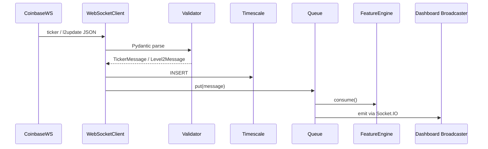

# Market Data Service (Coinbase Advanced Trade)

> **Status**: Draft – aligns with [ADR-018](../adr/ADR-018-market-data-service.md)

## Overview
The Market Data Service is responsible for real-time ingestion of Coinbase Advanced Trade WebSocket feeds, validation, persistence, and dissemination to downstream systems (feature engine, dashboard).

## Components
1. **WebSocket Client** (`apps/backend/services/market_data/websocket_client.py`)
   - Maintains connection, reconnection logic, and heartbeat.
2. **Validator** (Pydantic models)
   - Ensures message schema integrity.
3. **Persistence Layer**
   - Timescale hypertable `market_data` (timestamp, symbol, price, volume).
4. **Metrics & Tracing**
   - Prometheus metrics (`market_data.*`) and OTEL spans (`ws.message.process`).
5. **Fan-Out Queue**
   - Async `asyncio.Queue` (to be replaced by Kafka in Phase 2).

## Data Flow

## Operational Considerations
- **Latency Budget**: Ingestion ≤50 ms P95.
- **Resilience**: Exponential back-off, jitter, circuit-breaker after 5 failures.
- **Security**: WS feed is public; no authentication required.
- **Monitoring**: Alert on dropped message rate >0.1 % or latency >100 ms P95.

## Future Work (Phase 2)
- Extract into separate microservice.
- Kafka topic `market-data.raw` for fan-out.
- L2 order-book reconstruction and order-flow features.
- High-performance Rust or Go client for >10 k msg/s throughput.

_Last updated: 2025-07-05_ 