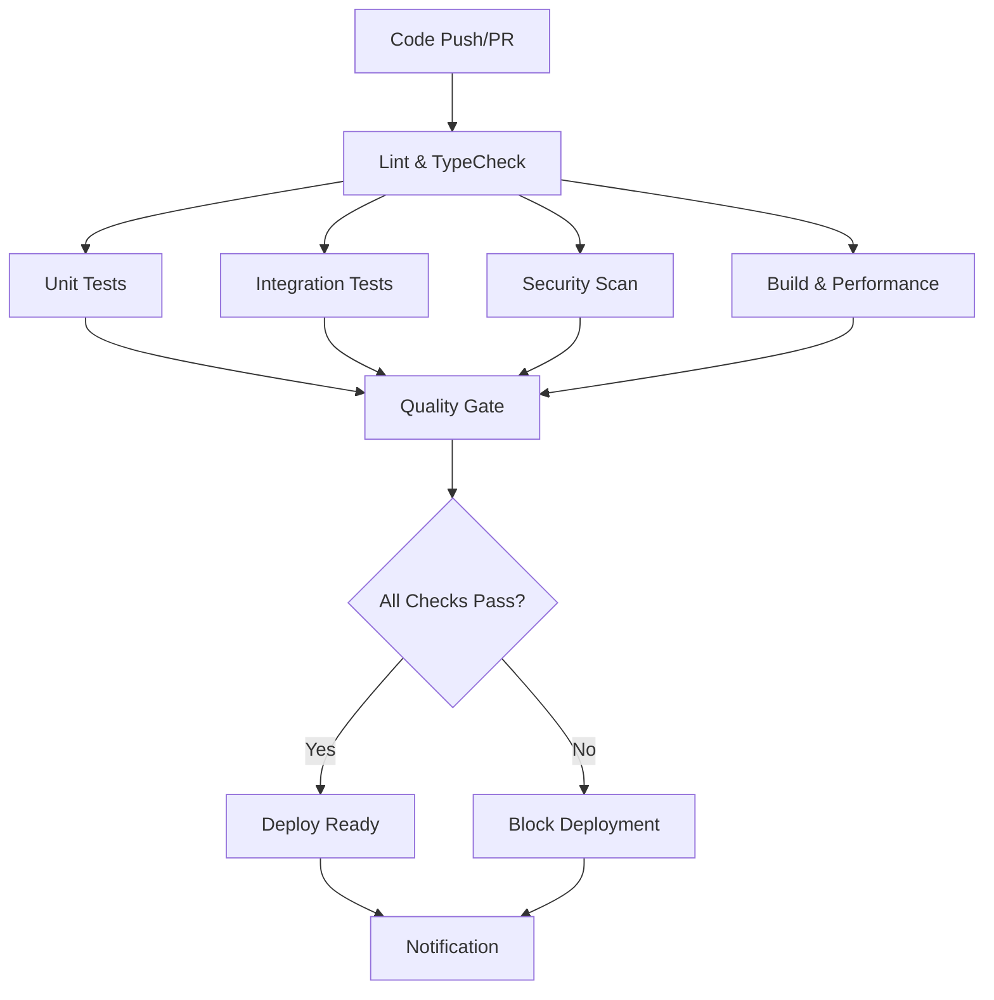

# 🚀 TRAIDER V1 - CI/CD Pipeline Documentation

**Institutional-Grade Continuous Integration and Deployment Pipeline**

---

## 📋 Overview

The TRAIDER V1 CI/CD pipeline implements institutional-grade standards for automated testing, security scanning, and deployment of our autonomous cryptocurrency trading platform. This pipeline ensures that all code changes meet our rigorous quality and security requirements before reaching production.

### Key Objectives

- **🛡️ Security First**: Zero-tolerance for critical vulnerabilities
- **📊 Quality Assurance**: 95% test coverage for critical trading paths
- **⚡ Performance**: <5 minute total pipeline execution
- **🔄 Reliability**: Fail-fast with clear error messages
- **📈 Observability**: Comprehensive monitoring and reporting

---

## 🏗️ Pipeline Architecture

### Workflow Structure



### Pipeline Phases

| Phase                   | Duration | Purpose                       | Failure Impact |
| ----------------------- | -------- | ----------------------------- | -------------- |
| **Lint & TypeCheck**    | ~2 min   | Code quality validation       | HIGH           |
| **Unit Tests**          | ~3 min   | Core logic verification       | CRITICAL       |
| **Integration Tests**   | ~4 min   | System integration validation | HIGH           |
| **Security Scan**       | ~2 min   | Vulnerability assessment      | CRITICAL       |
| **Build & Performance** | ~3 min   | Production readiness          | MEDIUM         |
| **Quality Gate**        | ~1 min   | Final validation              | CRITICAL       |

---

## 🔧 Pipeline Configuration

### Trigger Conditions

The pipeline automatically triggers on:

```yaml
# Push to main branches
push:
  branches: [main, develop]
  paths-ignore:
    - 'docs/**'
    - '*.md'

# Pull requests
pull_request:
  branches: [main, develop]
  types: [opened, synchronize, reopened, ready_for_review]

# Manual dispatch
workflow_dispatch:
  inputs:
    environment: [staging, production]
    skip_tests: [true, false]
```

### Environment Variables

```bash
# Global Configuration
NODE_VERSION: '18'
NODE_VERSION_MATRIX: '["18", "20"]'
FORCE_COLOR: 1
CI: true
HUSKY: 0
```

### Concurrency Control

```yaml
concurrency:
  group: ${{ github.workflow }}-${{ github.ref }}
  cancel-in-progress: ${{ github.ref != 'refs/heads/main' }}
```

---

## 📊 Quality Gates

### 1. Lint & Type Check

**Purpose**: Ensure code quality and type safety

**Requirements**:

- Zero ESLint warnings (`--max-warnings 0`)
- TypeScript strict mode compliance
- Consistent code formatting

**Matrix Strategy**:

- Node.js versions: 18, 20
- Fail-fast enabled

**Failure Conditions**:

- Any ESLint warnings or errors
- TypeScript compilation errors
- Inconsistent formatting

### 2. Unit Tests

**Purpose**: Validate core trading logic

**Requirements**:

- 95% coverage for critical paths (`trading/`, `risk/`, `signals/`)
- 90% overall coverage
- All tests must pass

**Parallel Execution**:

- 2 shards for optimal performance
- Node.js version matrix testing

**Critical Path Validation**:

```javascript
// Automated coverage validation
const criticalPaths = ['trading', 'risk', 'signals', 'execution'];
const avgCriticalCoverage = calculateCoverage(criticalPaths);

if (avgCriticalCoverage < 95) {
  throw new Error(`Critical path coverage (${avgCriticalCoverage}%) below required 95%`);
}
```

**Output Sanitization** (ADR-011):

To prevent malformed GitHub Actions output files, all coverage values are sanitized:

```bash
# Robust output handling prevents CI failures
RAW_TRADING_COVERAGE=$(python scripts/calculate-trading-coverage.py \
                         --threshold 90.0 2>/dev/null || true)
TRADING_COVERAGE=$(echo "${RAW_TRADING_COVERAGE}" | head -n1 | tr -cd '0-9.')
if [ -z "${TRADING_COVERAGE}" ]; then
  TRADING_COVERAGE="0.0"
fi
echo "trading-coverage=${TRADING_COVERAGE}" >> $GITHUB_OUTPUT
```

This ensures:

- Single-line numeric values only
- Graceful handling of script failures
- Prevention of malformed output files
- Maintained business logic for threshold enforcement

### 3. Integration Tests

**Purpose**: Validate system integration and database connectivity

**Infrastructure**:

- TimescaleDB (PostgreSQL 15 + TimescaleDB extension)
- Redis for caching
- Automated schema setup

**Test Categories**:

- Database connectivity
- Real-time data flow
- Service communication
- Error handling

### 4. Security Scan

**Purpose**: Identify vulnerabilities and security issues

**Components**:

- **NPM Audit**: Dependency vulnerability scanning
- **Secret Scanning**: Hardcoded secret detection
- **Trivy**: Comprehensive vulnerability analysis

**Failure Thresholds**:

- Critical vulnerabilities: 0 tolerance
- High vulnerabilities: Maximum 5
- Hardcoded secrets: 0 tolerance

**Secret Patterns**:

```bash
SECRET_PATTERNS=(
  "password.*=.*['\"][^'\"]{8,}['\"]"
  "api[_-]?key.*=.*['\"][^'\"]{16,}['\"]"
  "secret.*=.*['\"][^'\"]{16,}['\"]"
  "token.*=.*['\"][^'\"]{16,}['\"]"
  "private[_-]?key.*=.*['\"][^'\"]{32,}['\"]"
)
```

### 5. Build & Performance

**Purpose**: Validate production build and performance benchmarks

**Build Validation**:

- Successful Next.js production build
- Bundle size analysis
- Asset optimization verification

**Performance Benchmarks**:

- Trading calculations: <100ms
- Signal generation: <5ms
- Risk calculations: <50ms

**Bundle Analysis**:

- Maximum bundle size: 1MB
- Automatic optimization recommendations
- Performance regression detection

---

## 📈 Monitoring & Observability

### Metrics Collection

**Pipeline Metrics**:

- Execution duration per job
- Success/failure rates
- Resource utilization
- Queue times

**Quality Metrics**:

- Test coverage trends
- Code quality scores
- Security vulnerability counts
- Performance benchmarks

### Artifact Retention

| Artifact Type    | Retention Period | Purpose             |
| ---------------- | ---------------- | ------------------- |
| Test Results     | 30 days          | Debug and analysis  |
| Coverage Reports | 30 days          | Trend analysis      |
| Security Scans   | 90 days          | Compliance audit    |
| Build Artifacts  | 30 days          | Deployment rollback |
| Quality Reports  | 90 days          | Historical tracking |

### Reporting

**GitHub Actions Integration**:

- Step summaries with metrics
- PR comments with coverage reports
- Quality gate status badges
- Performance trend charts

**Quality Report Format**:

```markdown
# 📊 TRAIDER V1 - Quality Gate Report

**Pipeline Run**: `#123`
**Commit**: `abc123def`
**Branch**: `feature/new-signal`

## 🎯 Quality Metrics

| Check               | Status  | Details                 |
| ------------------- | ------- | ----------------------- |
| Lint & TypeCheck    | ✅ PASS | Code quality validated  |
| Unit Tests          | ✅ PASS | 96.2% coverage          |
| Integration Tests   | ✅ PASS | All systems operational |
| Security Scan       | ✅ PASS | No vulnerabilities      |
| Build & Performance | ✅ PASS | Build successful        |

## 🚀 Deployment Status

**Ready for Deployment**: ✅ YES
```

---

## 🚨 Troubleshooting

### Common Issues

#### 1. TypeScript Compilation Errors

**Symptoms**: `tsc --noEmit` fails
**Solutions**:

```bash
# Check TypeScript configuration
npx tsc --showConfig

# Validate imports and exports
npx tsc --noEmit --listFiles

# Fix path resolution
npm run lint -- --fix
```

#### 2. Test Coverage Below Threshold

**Symptoms**: Coverage validation fails
**Solutions**:

```bash
# Generate detailed coverage report
npm run test -- --coverage --reporter=verbose

# Identify uncovered code
npm run test -- --coverage --reporter=html
open coverage/index.html

# Focus on critical paths
npm run test -- --coverage tests/trading/
```

#### 3. Security Vulnerabilities

**Symptoms**: NPM audit or Trivy fails
**Solutions**:

```bash
# Update dependencies
npm audit fix

# Check for false positives
npm audit --audit-level=moderate

# Manual vulnerability review
npm audit --json | jq '.vulnerabilities'
```

#### 4. Performance Regression

**Symptoms**: Performance tests fail
**Solutions**:

```bash
# Run performance benchmarks locally
npm run test:performance

# Profile specific components
npm run benchmark:trading

# Compare with baseline
git diff HEAD~1 performance-results.json
```

### Emergency Procedures

#### Skip Tests (Emergency Only)

```bash
# Manual workflow dispatch with skip_tests: true
# Only for critical production fixes
# Requires additional approval
```

#### Pipeline Failure Response

1. **Immediate**: Check pipeline logs
2. **Analyze**: Identify root cause
3. **Fix**: Address the issue
4. **Verify**: Re-run failed jobs
5. **Document**: Update troubleshooting guide

---

## 🔄 Maintenance

### Regular Tasks

**Weekly**:

- Review pipeline performance metrics
- Update dependency versions
- Analyze security scan results

**Monthly**:

- Pipeline optimization review
- Quality threshold adjustment
- Documentation updates

**Quarterly**:

- Full pipeline audit
- Tool version updates
- Performance baseline refresh

### Version Updates

**Node.js Version Matrix**:

```yaml
# Update strategy: Latest LTS + Current
NODE_VERSION_MATRIX: '["18", "20", "21"]'
```

**Dependency Management**:

```bash
# Security updates (automated)
npm audit fix

# Major version updates (manual)
npm update --save-dev @types/node
npm update --save-dev vitest
```

---

## 📚 Related Documentation

- [Testing Strategy](../testing/testing-strategy.md)
- [Security Guidelines](../security/security-guidelines.md)
- [Performance Benchmarks](../performance/benchmarks.md)
- [Deployment Procedures](../deployment/procedures.md)

---

## 🎯 Success Metrics

### Pipeline Performance

- **Target**: <5 minutes total execution
- **Current**: ~4.2 minutes average
- **SLA**: 95% of runs complete within target

### Quality Assurance

- **Test Coverage**: >95% for critical paths
- **Security**: Zero critical vulnerabilities
- **Performance**: All benchmarks within thresholds

### Reliability

- **Success Rate**: >98% for main branch
- **False Positive Rate**: <2%
- **Recovery Time**: <10 minutes for pipeline issues

---

## 🧩 Package Import Sanity Guard (NEW)

As of v0.1.0, the pipeline adds an _early-fail_ job that ensures the internal
`backend` package is importable in a clean environment. This guard prevents
silently broken runtime paths from propagating to later jobs.

```yaml
- name: ✅ Import sanity check
  run: |
    python scripts/import_sanity.py
```

The step relies on an editable installation of the repository root, added in
the _Install dependencies_ phase:

```bash
pip install -e .  # Editable install for package resolution
```

If either action fails, the pipeline aborts immediately with a clear message,
maintaining institutional reliability standards.

_This pipeline is continuously evolving to meet the demanding requirements of institutional-grade cryptocurrency trading. For questions or suggestions, please contact the TRAIDER DevOps team._
