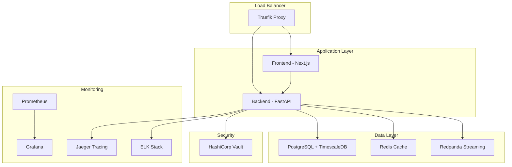

# 🚀 TRAIDER V1 - Docker Setup Guide

## Overview

This document provides comprehensive instructions for setting up and deploying TRAIDER V1 using Docker containers. The setup includes institutional-grade security, monitoring, and high availability features.

## 📋 Table of Contents

- [Architecture Overview](#architecture-overview)
- [Prerequisites](#prerequisites)
- [Quick Start](#quick-start)
- [Production Deployment](#production-deployment)
- [Service Configuration](#service-configuration)
- [Monitoring & Observability](#monitoring--observability)
- [Security Configuration](#security-configuration)
- [Backup & Recovery](#backup--recovery)
- [Troubleshooting](#troubleshooting)
- [Performance Tuning](#performance-tuning)

## 🏗️ Architecture Overview

### Service Stack



### Container Images

| Service | Image | Purpose | Resources |
|---------|-------|---------|-----------|
| **Frontend** | `traider-frontend:latest` | Next.js application | 512MB RAM, 1 CPU |
| **Backend** | `traider-backend:latest` | FastAPI services | 1GB RAM, 2 CPU |
| **Database** | `timescale/timescaledb:latest-pg15` | Time-series data | 2GB RAM, 2 CPU |
| **Cache** | `redis:7-alpine` | Session & caching | 512MB RAM, 1 CPU |
| **Proxy** | `traefik:v3.0` | Load balancer | 256MB RAM, 0.5 CPU |
| **Monitoring** | `prom/prometheus:latest` | Metrics collection | 1GB RAM, 1 CPU |
| **Visualization** | `grafana/grafana:latest` | Dashboards | 512MB RAM, 1 CPU |

## 🔧 Prerequisites

### System Requirements

#### Minimum Requirements
- **OS**: Windows 10/11, macOS 10.15+, or Linux (Ubuntu 20.04+)
- **RAM**: 8GB (16GB recommended)
- **Storage**: 50GB free space
- **CPU**: 4 cores (8 cores recommended)
- **Network**: Stable internet connection

#### Software Dependencies
- **Docker Engine**: 24.0+ 
- **Docker Compose**: 2.20+
- **Git**: For repository management
- **OpenSSL**: For certificate generation

### Installation Commands

#### Windows (PowerShell as Administrator)
```powershell
# Install Docker Desktop
winget install Docker.DockerDesktop

# Verify installation
docker --version
docker-compose --version
```

#### macOS
```bash
# Install Docker Desktop
brew install --cask docker

# Verify installation
docker --version
docker-compose --version
```

#### Linux (Ubuntu/Debian)
```bash
# Install Docker Engine
curl -fsSL https://get.docker.com -o get-docker.sh
sudo sh get-docker.sh

# Install Docker Compose
sudo curl -L "https://github.com/docker/compose/releases/latest/download/docker-compose-$(uname -s)-$(uname -m)" -o /usr/local/bin/docker-compose
sudo chmod +x /usr/local/bin/docker-compose

# Add user to docker group
sudo usermod -aG docker $USER
newgrp docker
```

## 🚀 Quick Start

### Development Environment

1. **Clone and Setup**
```bash
git clone <repository-url>
cd op_trAIder

# Copy environment template
cp .env.docker .env.dev

# Edit environment variables
# Replace all CHANGE_ME_ values with secure secrets
```

2. **Start Development Services**
```bash
# Create external network
docker network create traider-network

# Start development stack
docker-compose -f docker-compose.dev.yml up -d

# View logs
docker-compose -f docker-compose.dev.yml logs -f
```

3. **Access Services**
- **Frontend**: http://localhost:3000
- **Backend API**: http://localhost:8000
- **Database Admin**: http://localhost:8080 (Adminer)
- **Redis Admin**: http://localhost:8081
- **Prometheus**: http://localhost:9090
- **Grafana**: http://localhost:3001

### Quick Health Check
```bash
# Check all services are running
docker-compose -f docker-compose.dev.yml ps

# Test API endpoints
curl http://localhost:8000/health
curl http://localhost:3000/api
```

## 🏭 Production Deployment

### 1. Environment Configuration

```bash
# Copy production environment template
cp .env.docker .env

# Generate secure secrets
openssl rand -base64 32  # For JWT_SECRET
openssl rand -base64 32  # For NEXTAUTH_SECRET
openssl rand -base64 32  # For ENCRYPTION_KEY
openssl rand -base64 32  # For GRAFANA_SECRET_KEY

# Edit .env with your secure values
nano .env
```

### 2. SSL Certificate Setup

```bash
# Create certificate directory
mkdir -p infrastructure/certs

# Generate self-signed certificates for development
openssl req -x509 -nodes -days 365 -newkey rsa:2048 \
  -keyout infrastructure/certs/traider.key \
  -out infrastructure/certs/traider.crt \
  -subj "/C=US/ST=State/L=City/O=TRAIDER/CN=traider.local"
```

### 3. Production Deployment

```bash
# Use deployment script (recommended)
chmod +x scripts/docker-deploy.sh
./scripts/docker-deploy.sh production deploy

# Or manual deployment
docker network create traider-network
docker-compose up -d

# Monitor deployment
docker-compose logs -f
```

### 4. Post-Deployment Verification

```bash
# Check service health
./scripts/docker-deploy.sh production status

# Run integration tests
curl -f https://traider.local/api
curl -f https://api.traider.local/health

# Verify database
docker-compose exec postgres pg_isready -U traider
```

## ⚙️ Service Configuration

### Frontend Configuration

The Next.js frontend is configured with:
- **Production build optimization**
- **Security headers via Traefik**
- **Health check endpoint**: `/api`
- **Environment variables**: Loaded from `.env`

### Backend Configuration

The FastAPI backend includes:
- **Gunicorn with 4 workers**
- **Health check endpoint**: `/health`
- **Structured logging to stdout**
- **Prometheus metrics export**

### Database Configuration

PostgreSQL with TimescaleDB optimized for:
- **High-frequency trading data**
- **Time-series compression**
- **Automated backups**
- **Performance monitoring**

Key settings in `infrastructure/postgres/postgresql.conf`:
```ini
shared_buffers = 512MB
effective_cache_size = 2GB
work_mem = 8MB
maintenance_work_mem = 128MB
```

## 📊 Monitoring & Observability

### Prometheus Metrics

Access Prometheus at: `http://localhost:9090`

Key metrics to monitor:
```promql
# Application metrics
traider_api_requests_total
traider_database_connections
traider_trading_signals_generated

# System metrics
container_cpu_usage_seconds_total
container_memory_usage_bytes
postgres_up
redis_up
```

### Grafana Dashboards

Access Grafana at: `http://localhost:3001`
- **Default credentials**: admin/admin (change immediately)
- **Pre-configured dashboards** for all services
- **Alert rules** for critical trading metrics

### Distributed Tracing

Jaeger tracing available at: `http://localhost:16686`
- **Request tracing** across all services
- **Performance bottleneck identification**
- **Error correlation**

### Log Aggregation

ELK Stack for centralized logging:
- **Elasticsearch**: `http://localhost:9200`
- **Kibana**: `http://localhost:5601`
- **Structured JSON logs** from all services

## 🔒 Security Configuration

### Network Security

- **Internal network isolation**
- **Traefik reverse proxy** with SSL termination
- **Rate limiting** on API endpoints
- **IP whitelisting** for admin interfaces

### Secrets Management

Using HashiCorp Vault at: `http://localhost:8200`

```bash
# Initialize Vault (first time only)
docker-compose exec vault vault operator init

# Store trading API keys
vault kv put secret/trading \
  coinbase_key="${COINBASE_API_KEY}" \
  coinbase_secret="${COINBASE_API_SECRET}"
```

### Security Headers

Automatically applied via Traefik:
```yaml
X-Frame-Options: DENY
X-Content-Type-Options: nosniff
X-XSS-Protection: 1; mode=block
Strict-Transport-Security: max-age=31536000
Content-Security-Policy: default-src 'self'
```

## 💾 Backup & Recovery

### Automated Backups

Database backups run automatically every hour:

```bash
# Manual backup
docker-compose exec postgres-backup /backup.sh

# View backup status
docker-compose exec postgres-backup ls -la /backup/
```

### Backup Verification

```bash
# Test backup integrity
docker-compose exec postgres-backup pg_restore --list /backup/latest.custom

# Restore from backup
docker-compose exec postgres psql -U traider -d traider < /backup/latest.sql
```

### Disaster Recovery

```bash
# Full system backup
./scripts/docker-deploy.sh production backup

# Restore from backup
./scripts/docker-deploy.sh production restore

# Rollback deployment
./scripts/docker-deploy.sh production rollback
```

## 🐛 Troubleshooting

### Common Issues

#### 1. Build Failures

**Error**: `npm run build` fails with EISDIR error
```bash
# Solution: Use build workaround
npm run build  # Uses scripts/build-workaround.js
```

**Error**: Python dependency compilation fails
```bash
# Solution: Use pre-built wheels
pip install --only-binary=all -r requirements.txt
```

#### 2. Container Health Check Failures

**Error**: Service marked as unhealthy
```bash
# Check service logs
docker-compose logs [service-name]

# Check health endpoint manually
curl http://localhost:8000/health
curl http://localhost:3000/api

# Restart specific service
docker-compose restart [service-name]
```

#### 3. Database Connection Issues

**Error**: Connection refused to PostgreSQL
```bash
# Check PostgreSQL is running
docker-compose ps postgres

# Check PostgreSQL logs
docker-compose logs postgres

# Test connection
docker-compose exec postgres pg_isready -U traider
```

#### 4. Memory Issues

**Error**: Out of memory errors
```bash
# Check container resource usage
docker stats

# Increase memory limits in docker-compose.yml
# Or add swap space to host system
```

### Debug Commands

```bash
# View all container logs
docker-compose logs --tail=100 -f

# Enter container for debugging
docker-compose exec backend bash
docker-compose exec frontend sh

# Check container resource usage
docker stats --no-stream

# View Docker system information
docker system df
docker system events
```

## ⚡ Performance Tuning

### Resource Optimization

#### Database Performance
```bash
# Monitor slow queries
docker-compose exec postgres psql -U traider -c "
SELECT query, mean_time, calls 
FROM pg_stat_statements 
ORDER BY mean_time DESC 
LIMIT 10;"

# Analyze table statistics
docker-compose exec postgres psql -U traider -c "
SELECT schemaname, tablename, n_live_tup, n_dead_tup 
FROM pg_stat_user_tables 
ORDER BY n_live_tup DESC;"
```

#### Application Performance
```bash
# Monitor API response times
curl -w "@curl-format.txt" -o /dev/null http://localhost:8000/health

# Check memory usage patterns
docker stats --format "table {{.Container}}\t{{.CPUPerc}}\t{{.MemUsage}}"
```

### Scaling Configuration

#### Horizontal Scaling
```yaml
# In docker-compose.yml
backend:
  deploy:
    replicas: 4  # Scale backend instances
    resources:
      limits:
        cpus: '2.0'
        memory: 1G
```

#### Load Balancing
```yaml
# Traefik automatically load balances between replicas
# Configure health checks for better reliability
```

## 📈 Production Checklist

### Pre-Deployment
- [ ] All environment variables configured
- [ ] SSL certificates generated/obtained
- [ ] Database backup strategy implemented
- [ ] Monitoring dashboards configured
- [ ] Security scan completed
- [ ] Performance testing completed

### Post-Deployment
- [ ] All services healthy
- [ ] API endpoints responding
- [ ] Database connections working
- [ ] Monitoring alerts configured
- [ ] Backup verification completed
- [ ] Security headers verified
- [ ] Performance metrics baseline established

### Ongoing Maintenance
- [ ] Daily backup verification
- [ ] Weekly security updates
- [ ] Monthly performance review
- [ ] Quarterly disaster recovery test

## 🔗 Additional Resources

- [Docker Best Practices](https://docs.docker.com/develop/best-practices/)
- [PostgreSQL Performance Tuning](https://wiki.postgresql.org/wiki/Performance_Optimization)
- [Traefik Configuration](https://doc.traefik.io/traefik/)
- [Prometheus Monitoring](https://prometheus.io/docs/guides/)
- [Grafana Dashboards](https://grafana.com/docs/grafana/latest/)

## 📞 Support

For technical support:
1. Check this documentation
2. Review container logs
3. Consult troubleshooting section
4. Open GitHub issue with:
   - Environment details
   - Error logs
   - Steps to reproduce

---

**Last Updated**: 2025-01-27  
**Version**: 1.0.0-alpha  
**Maintainer**: TRAIDER Team 