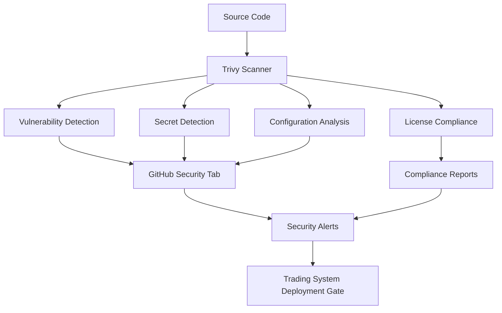

# 🛡️ Trivy Security Integration Guide

## Overview

This document outlines the integration of **Trivy** as the primary security scanning solution for TRAIDER V1, replacing both Snyk and GitLeaks with a single, open-source security scanner.

### Why Trivy?

- **🆓 100% Open Source**: No licensing costs or API tokens required
- **🎯 Comprehensive Coverage**: Vulnerabilities, secrets, misconfigurations, and licenses
- **⚡ High Performance**: Fast scanning with minimal resource usage
- **🔄 CI/CD Ready**: Native GitHub Actions integration
- **📊 Multiple Formats**: SARIF, JSON, table outputs for different use cases

## Architecture



## Scanning Capabilities

### 1. Vulnerability Scanning (`vuln`)

Detects known security vulnerabilities in:

- **Node.js**: npm packages, package-lock.json
- **Python**: pip packages, requirements.txt
- **Container Images**: Base images and installed packages
- **Operating System**: OS packages in containers

**Supported Ecosystems**:

- npm/Yarn (JavaScript/TypeScript)
- pip/Poetry (Python)
- Go modules
- Rust crates
- And 30+ more

### 2. Secret Detection (`secret`)

Identifies hardcoded credentials and sensitive data:

- **API Keys**: AWS, Google Cloud, Azure, etc.
- **Database Credentials**: Connection strings, passwords
- **Private Keys**: SSH keys, TLS certificates
- **Tokens**: JWT tokens, OAuth tokens
- **Custom Patterns**: Configurable regex patterns

**Built-in Rules**: 190+ secret detection patterns

### 3. Configuration Scanning (`config`)

Analyzes infrastructure and configuration files:

- **Docker**: Dockerfile best practices
- **Kubernetes**: Security policies, RBAC
- **Terraform**: Infrastructure misconfigurations
- **GitHub Actions**: Workflow security
- **YAML/JSON**: General configuration issues

### 4. License Compliance (`license`)

Tracks software licenses for compliance:

- **License Detection**: Automatic license identification
- **Compliance Checking**: GPL, AGPL, commercial compatibility
- **Dependency Mapping**: License per dependency
- **Risk Assessment**: License compatibility analysis

## Usage

### Local Development

#### Quick Security Scan

```bash
# Full security scan
npm run security:trivy

# Secrets only (fast)
npm run security:trivy:secrets

# Vulnerabilities only
npm run security:trivy:vuln

# Configuration issues only
npm run security:trivy:config
```

#### Advanced Usage

```bash
# Scan with specific severity threshold
trivy fs --severity HIGH,CRITICAL .

# Scan specific directory
trivy fs --scanners secret app/

# Output to JSON for processing
trivy fs --format json --output results.json .

# Scan container image
trivy image node:18-alpine

# Scan with custom ignore file
trivy fs --ignorefile .trivyignore .
```

### Pre-commit Integration

Trivy runs automatically on every commit via Husky pre-commit hooks:

```bash
# Pre-commit will run:
trivy fs --scanners secret --format table --quiet .
```

**What happens**:

1. Scans only staged files for secrets
2. Fails commit if secrets detected
3. Shows detailed findings
4. Provides remediation guidance

### CI/CD Pipeline

The GitHub Actions workflow (`.github/workflows/trivy-security.yml`) runs:

#### Trigger Events

- **Push**: to `main` or `develop` branches
- **Pull Request**: opened, synchronized, reopened
- **Schedule**: Daily at 01:00 UTC
- **Manual**: Workflow dispatch with options

#### Scan Jobs

1. **Vulnerability Scan**: Dependencies and OS packages
2. **Secret Detection**: Source code and configuration
3. **Configuration Analysis**: Infrastructure files
4. **License Compliance**: Dependency licenses
5. **Container Security**: Docker images (if present)

#### Quality Gates

- **Critical Vulnerabilities**: 0 allowed (blocks deployment)
- **High Vulnerabilities**: 5 allowed (warning)
- **Secrets**: 0 allowed (blocks deployment)
- **Misconfigurations**: Warning only

## Configuration

### Severity Thresholds

Configure minimum severity levels:

```yaml
# In workflow or CLI
severity: MEDIUM,HIGH,CRITICAL
```

**Severity Levels**:

- `LOW`: Informational issues
- `MEDIUM`: Minor security concerns
- `HIGH`: Significant security risks
- `CRITICAL`: Severe security vulnerabilities

### Ignore Rules (`.trivyignore`)

Suppress false positives and acceptable risks:

```bash
# Ignore specific CVE
CVE-2023-12345

# Ignore test files
test/**
**/*.test.js

# Ignore specific secret type
generic-api-key

# Ignore file path
config/test-secrets.json
```

### Custom Scanning

#### Environment Variables

```bash
# Set severity threshold
export TRIVY_SEVERITY=HIGH,CRITICAL

# Enable debug output
export TRIVY_DEBUG=true

# Custom ignore file
export TRIVY_IGNOREFILE=.custom-ignore
```

#### Configuration File (`trivy.yaml`)

```yaml
# Global configuration
format: json
severity:
  - HIGH
  - CRITICAL
scanners:
  - vuln
  - secret
  - config

# Vulnerability settings
vulnerability:
  type:
    - os
    - library

# Secret settings
secret:
  skip-files:
    - 'test/**'
    - '**/*.test.*'
```

## Integration Points

### 1. GitHub Security Tab

All Trivy findings automatically appear in:

- **Security → Code scanning alerts**
- **Security → Secret scanning alerts**
- **Pull request security checks**

### 2. Quality Gates

Trivy integrates with deployment pipelines:

- **Critical findings**: Block deployment
- **High findings**: Generate warnings
- **Medium/Low findings**: Informational

### 3. Monitoring & Alerting

Security metrics tracked:

- Vulnerability counts by severity
- Secret detection events
- Configuration drift alerts
- License compliance status

## Troubleshooting

### Common Issues

#### 1. False Positive Secrets

**Problem**: Trivy detects test data as secrets
**Solution**: Add patterns to `.trivyignore`

```bash
# Add to .trivyignore
test/fixtures/**
**/*.example
```

#### 2. Slow Vulnerability Scans

**Problem**: Large dependency trees cause timeouts
**Solution**: Use targeted scanning

```bash
# Scan only changed files
trivy fs --scanners vuln package.json
```

#### 3. Container Scan Failures

**Problem**: Docker build fails during scanning
**Solution**: Check Dockerfile syntax and dependencies

```bash
# Test build locally
docker build -f Dockerfile.frontend -t test .
trivy image test
```

#### 4. High False Positive Rate

**Problem**: Too many irrelevant findings
**Solution**: Tune severity thresholds and ignore patterns

```bash
# Reduce noise
trivy fs --severity HIGH,CRITICAL --skip-dirs node_modules .
```

### Debug Mode

Enable detailed logging:

```bash
# CLI debug
trivy fs --debug .

# Workflow debug
# Set ACTIONS_STEP_DEBUG=true in repository secrets
```

### Performance Optimization

#### 1. Selective Scanning

```bash
# Scan only specific file types
trivy fs --scanners secret --skip-dirs node_modules .

# Skip large directories
trivy fs --skip-dirs "node_modules,coverage,dist" .
```

#### 2. Caching

```bash
# Use Trivy cache (automatic in CI)
trivy fs --cache-dir /tmp/trivy-cache .
```

#### 3. Parallel Execution

The workflow runs multiple scan types in parallel for optimal performance.

## Migration from Snyk/GitLeaks

### Replaced Functionality

| Old Tool       | Old Command           | New Trivy Command            |
| -------------- | --------------------- | ---------------------------- |
| Snyk OSS       | `snyk test`           | `trivy fs --scanners vuln`   |
| Snyk Container | `snyk container test` | `trivy image`                |
| Snyk IaC       | `snyk iac test`       | `trivy fs --scanners config` |
| GitLeaks       | `gitleaks detect`     | `trivy fs --scanners secret` |

### Configuration Migration

#### Old Snyk Configuration

```json
{
  "severity-threshold": "medium",
  "ignore": ["SNYK-JS-123"]
}
```

#### New Trivy Configuration

```bash
# .trivyignore
CVE-2023-123
test/**
```

### Workflow Migration

#### Before (Multiple Tools)

```yaml
- name: Snyk test
  run: snyk test
- name: GitLeaks scan
  run: gitleaks detect
```

#### After (Single Tool)

```yaml
- name: Trivy scan
  uses: aquasecurity/trivy-action@master
  with:
    scanners: 'vuln,secret,config'
```

## Best Practices

### 1. Regular Updates

```bash
# Keep Trivy database updated (automatic in CI)
trivy image --download-db-only
```

### 2. Baseline Scanning

```bash
# Establish security baseline
trivy fs --format json --output baseline.json .
```

### 3. Custom Rules

```yaml
# Add custom secret patterns
secret:
  config: |
    rules:
      - id: traider-api-key
        regex: 'TRAIDER_[A-Z0-9]{32}'
        description: 'TRAIDER API Key'
```

### 4. Integration Testing

```bash
# Test security in CI
npm run security:trivy || exit 1
```

### 5. Documentation

- Document all ignore rules with justification
- Maintain security baseline documentation
- Regular security review meetings

## Compliance & Auditing

### Audit Trail

- All scan results stored for 90 days
- SARIF format for compliance tools
- Detailed finding metadata

### Reporting

```bash
# Generate compliance report
trivy fs --format json --output compliance-report.json .
```

### Retention Policy

- **Scan Results**: 90 days
- **Security Alerts**: 1 year
- **Compliance Reports**: 7 years

## Support & Resources

### Documentation

- [Trivy Official Docs](https://aquasecurity.github.io/trivy/)
- [GitHub Actions Integration](https://github.com/aquasecurity/trivy-action)
- [Configuration Reference](https://aquasecurity.github.io/trivy/latest/docs/configuration/)

### Community

- [GitHub Discussions](https://github.com/aquasecurity/trivy/discussions)
- [Slack Channel](https://slack.aquasec.com/)

### Internal Resources

- **Security Team**: security@traider.com
- **DevOps Team**: devops@traider.com
- **Documentation**: [Security Guidelines](security-guidelines.md)

---

**Author**: TRAIDER Security Team  
**Last Updated**: 2024-01-XX  
**Version**: 1.0.0  
**Review Cycle**: Monthly
